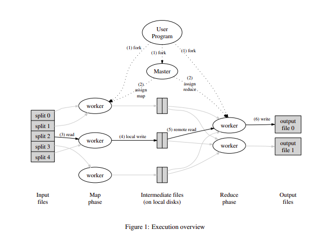

# Distributed MapReduce

MapReduce model implemented as per this paper

[MapReduce: Simplified Data Processing on Large Clusters](http://nil.csail.mit.edu/6.824/2020/papers/mapreduce.pdf)

## Overview

## Execution

Master 
- keeps track of map jobs, reduce jobs and backlog jobs
- pings worker at regular intervals about job status
- in case worker is down, pushes its job to backlog
- when worker asks for job, assigns one from backlog, map, or reduce jobs

Worker
- connects to master
- asks for job
- pings master when job is done

## In Action

## Usage

- start a master: `make master`
- start workers: `make worker NAME=worker_name`